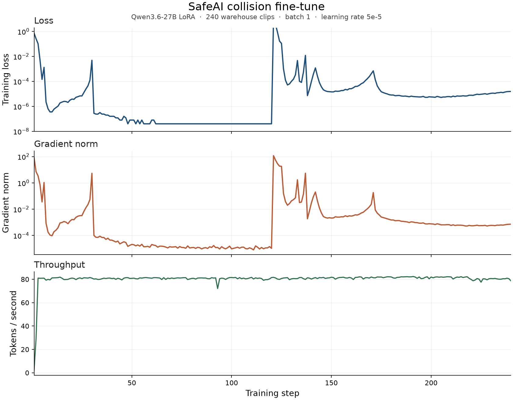

# SafeAI

SafeAI is an early-warning model for warehouse footage. Given a short clip from before an incident, it returns the probability that a person and a machine are about to collide. It does not predict the exact second of impact.

The base model is [Valen-Preview-0923](https://huggingface.co/Valen-Team/Valen-Preview-0923), a decision model on Qwen3.5-2B. It scores a yes/no question over video instead of generating a caption. Fine-tuning continues from that checkpoint with Valen's supervised trainer. Weights & Biases is used to log the run.

## Goal

Warehouse captions rarely say "collision." They describe a person walking up to a forklift, grabbing it, or moving out of its way, and robots sharing the floor with workers. SafeAI treats that lead-up as the signal.

At inference the model sees a few frames and answers one question: will a collision happen within the next few seconds? The output is a single probability. The time of impact stays unknown.

## What a training example is

Each example is a two-frame clip plus a boolean label and a YOLO sidecar.

| Field | Meaning |
|---|---|
| `clip` | Two frames, 0.1 seconds apart, packed as a short mp4 |
| `label` | `true` if a person–machine collision or contact follows this clip. `false` if it does not |
| `yolo` | Boxes for those two frames: `label`, `confidence`, and `bbox` as `[x1, y1, x2, y2]` |

```json
{"clip": "train/yes_002_p00.mp4", "label": true, "yolo": "train/yes_002_p00.yolo.json"}
```

The frames are the opening second of a 5-second archive segment, sampled every 0.1 seconds and joined into non-overlapping pairs: `(0.0, 0.1)`, `(0.2, 0.3)`, `(0.4, 0.5)`, `(0.6, 0.7)`, `(0.8, 0.9)`. Five pairs come from each download. Every pair from one download shares that download's label.

YOLO11 (COCO) supplies the boxes. `person` is the reliable class. Forklifts are not a COCO class, so they show up as `truck`, `car`, or another class when they are detected at all.

The mp4 files are gitignored and stay on the machine that downloaded them. Manifests and YOLO json are in the repo.

## Dataset

Clips come from the indexed warehouse cameras: `warehouse3` (forklift floor) and the indoor warehouse set (people and robots). A segment is positive when the caption describes contact, a climb onto a machine, or a person approaching or leaving a forklift or robot. Phrases such as "no accident" and "speed bump" are rejected. Negatives are an equal number of other segments from those same cameras that do not match that query.

| | 5-second downloads | Frame pairs |
|---|---:|---:|
| Collision | 40 | 200 |
| No collision | 40 | 200 |
| Total | 80 | 400 |

| Location | Collision | No collision |
|---|---:|---:|
| `warehouse3` | 31 | 29 |
| indoor warehouse | 9 | 11 |

| Split | Pairs | Collision | No collision |
|---|---:|---:|---:|
| train | 240 | 120 | 120 |
| eval | 80 | 40 | 40 |
| test | 80 | 40 | 40 |

Pairs from the same download stay in one split, so a clip and its sibling pairs do not leak across train, eval, and test.

Manifests:

```text
data_collection_agent/processed_clips/manifest.jsonl
data_collection_agent/processed_clips/train/manifest.jsonl
data_collection_agent/processed_clips/eval/manifest.jsonl
data_collection_agent/processed_clips/test/manifest.jsonl
```

## How the data is built

`data_collection_agent/` holds two skills and the scripts they describe.

`fetch-collisions` scans segment captions with the phrases in `data_collection_agent/fetch-collisions/keywords.json`, downloads each 5-second segment, and saves the YOLO sidecar.

```bash
python3 data_collection_agent/fetch_collisions.py \
  --locations warehouse3,indoor \
  --all-segments \
  --max-videos 0
```

`process-collision-clips` cuts the opening window into frame pairs and writes the splits. `--window-sec` and `--frame-gap-sec` change that cut without re-downloading.

```bash
python3 data_collection_agent/process_clip.py \
  --sources data_collection_agent/clips/sources.jsonl \
  --window-sec 1.0 \
  --frame-gap-sec 0.1
```

Login uses the team config already on the VM (`/config/*.config`). Credentials are not stored in this repo.

## Fine-tune input

Valen reads JSONL. Each record is one pair clip, a yes/no question, and a hard label. Video paths are local files next to the JSONL. `group_id` is the download name so the five pairs from one segment can be kept together.

```json
{
  "group_id": "yes_002",
  "request": {
    "state": {
      "messages": [{
        "role": "user",
        "content": [
          {"type": "text", "text": "Warehouse camera. Watch these frames."},
          {"type": "video_url", "video_url": {"url": "train/yes_002_p00.mp4"}}
        ]
      }]
    },
    "questions": {
      "imminent": {
        "type": "noul",
        "instructions": "Will a person and a robot or forklift collide within the next few seconds?"
      }
    }
  },
  "targets": {
    "imminent": {"probabilities": {"true": 1.0, "false": 0.0}}
  }
}
```

A negative example uses `"true": 0.0, "false": 1.0`. Training continues from the preview checkpoint at stage `vision_top` (or `warmup` if only the decision head should move). The held-out manifests are the eval and test sets.

## Training curve

The run that is logged today is a LoRA on [Qwen3.6-27B](https://wandb.ai/vastdata/team-43/runs/safeai-collision), trained with W&B Serverless SFT on the 240 train pairs. Batch size is 1 and the learning rate is 5e-5. Each step is one clip. The answer tokens are `true` or `false`.



Loss falls below 1e-4 within the first few steps, jumps again near step 120, and finishes near 1e-5. The step metrics are in `finetune/metrics.jsonl`.

`collision-data/` is an earlier, smaller pull (one contact clip and one calm clip). The warehouse set above is the one to train on.
