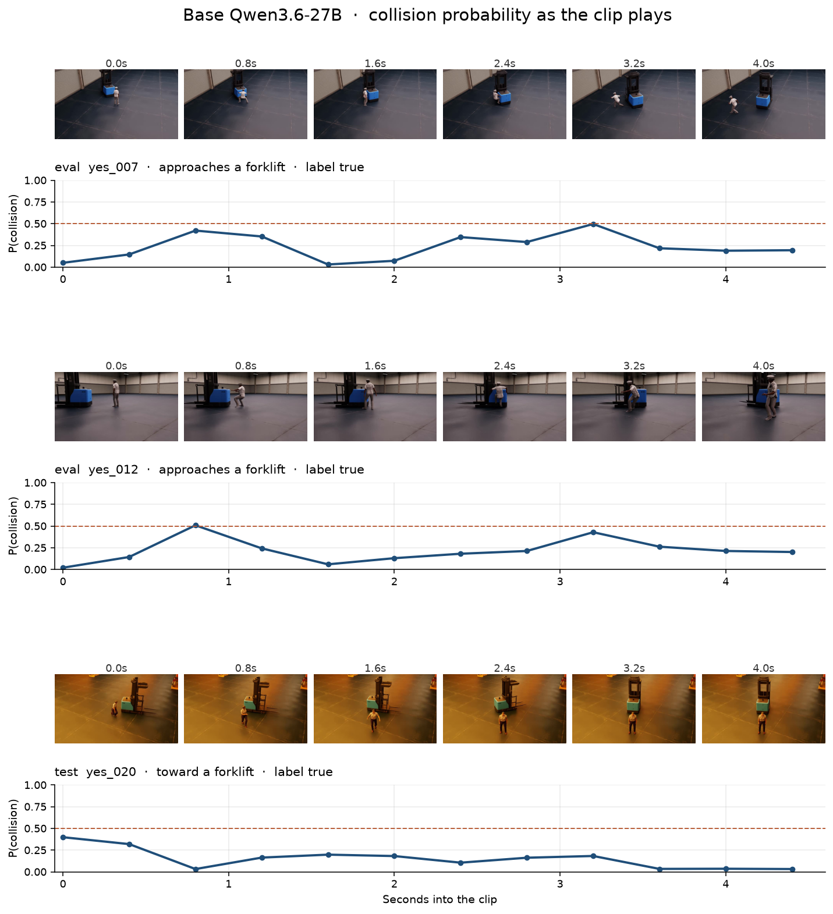

# VastCAM review pack

Held-out scores for the untouched base model, the finished training curve, and five clip pairs to watch. Each pair is two frames, 0.1 seconds apart, from the first second of a warehouse download.

The fine-tuned LoRA is artifact `vastdata/team-43/safeai-collision:v1` (rank 8, base `Qwen/Qwen3.6-27B`). Calling it on W&B inference returns model not found, including after a re-upload to `coreweave-us` as `safeai-collision-infer`. The fine-tuned column below is empty for that reason. Base scores are filled in.

Run page: https://wandb.ai/vastdata/team-43/runs/safeai-collision

## Training

Qwen3.6-27B LoRA, W&B Serverless SFT, 240 train pairs, batch size 1, learning rate 5e-5. The job finished all 240 steps on 2 Oct 2026, 22:51:25–22:56:37 UTC.

| | Value |
|---|---:|
| Loss, first step | 0.735 |
| Loss, mean | 0.0638 |
| Loss, lowest (step 48) | 4.0e-8 |
| Loss, final step | 1.56e-5 |
| Gradient norm, first → final | 84.7 → 7.3e-4 |

## Eval and test, base model

Untouched Qwen3.6-27B, thinking off, same true/false question as training. Probability is the softmax of the `true` and `false` token logprobs. A pair counts as a collision call when that probability is at least 0.5.

| | Eval | Test |
|---|---:|---:|
| Pairs | 80 | 80 |
| Accuracy | 0.513 | 0.500 |
| Precision | 1.000 | 0.000 |
| Recall | 0.025 | 0.000 |
| Collision pairs caught | 1 / 40 | 0 / 40 |
| No-collision pairs caught | 40 / 40 | 40 / 40 |
| Mean P(collision) on collision pairs | 0.142 | 0.075 |
| Mean P(collision) on no-collision pairs | 0.068 | 0.101 |

The base model answers `false` on 159 of 160 held-out pairs. The machine-readable copy is `baseline_summary.json`.

## Five clip pairs

These are collision pairs, label `true`. They are the held-out windows where the base score moves the most: early and late in `yes_007` and `yes_012`, plus the highest test score, `yes_020` at 0.0 seconds. `yes_007_p04` is the only held-out collision pair the base model calls correctly.

| Clip | Split | Base P(collision) | Base call | Fine-tuned P | Fine-tuned call |
|---|---|---:|---|---:|---|
| [eval_yes_007_p00.mp4](clips/eval_yes_007_p00.mp4) | eval | 0.033 | false | — | — |
| [eval_yes_007_p04.mp4](clips/eval_yes_007_p04.mp4) | eval | 0.533 | true | — | — |
| [eval_yes_012_p00.mp4](clips/eval_yes_012_p00.mp4) | eval | 0.053 | false | — | — |
| [eval_yes_012_p04.mp4](clips/eval_yes_012_p04.mp4) | eval | 0.449 | false | — | — |
| [test_yes_020_p00.mp4](clips/test_yes_020_p00.mp4) | test | 0.437 | false | — | — |

`p00` is the window at 0.0–0.1 seconds. `p04` is the window at 0.8–0.9 seconds. On `yes_007` and `yes_012` the base probability is higher in the later window, while the person is closer to the forklift, and it still stays under 0.5 except for `yes_007_p04`.

The same three downloads, sampled every 0.4 seconds across the full 5 seconds:

Per-clip scores for the five pairs are in `clip_scores.json`.
